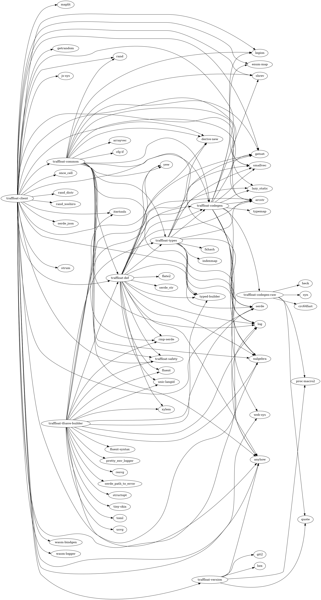

# API documentation
- [legion](./legion)
- [legion_codegen](./legion_codegen)
- [client](./client)
- [codegen](./codegen)
- [traffloat_codegen_raw](./traffloat_codegen_raw)
- [traffloat](./traffloat)
- [traffloat_def](./traffloat_def)
- [safety](./safety)
- [tfsave_builder](./tfsave_builder)
- [traffloat_types](./traffloat_types)
- [traffloat_version](./traffloat_version)

## Code statistics
```
===============================================================================
 Language            Files        Lines         Code     Comments       Blanks
===============================================================================
 FreeMarker             11          196          189            0            7
 GLSL                   10          151          104           16           31
 HTML                    2           60           58            0            2
 JavaScript              5           75           67            0            8
 Markdown                2          207            0          163           44
 Rust                  112        12268        10445          142         1681
 TOML                   55         1818         1530            2          286
===============================================================================
 Total                 197        14775        12393          323         2059
===============================================================================
```

## Dependency graph

