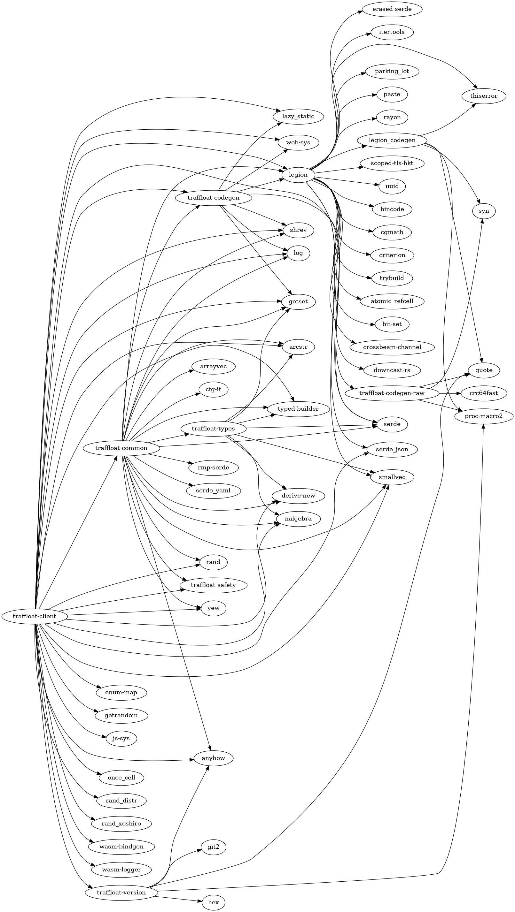

# API documentation
- [client](./client)
- [codegen](./codegen)
- [traffloat_codegen_raw](./traffloat_codegen_raw)
- [traffloat](./traffloat)
- [safety](./safety)
- [traffloat_types](./traffloat_types)
- [traffloat_version](./traffloat_version)
- [tsvtool](./tsvtool)

## Code statistics
```
===============================================================================
 Language            Files        Lines         Code     Comments       Blanks
===============================================================================
 GLSL                   10          148          103           16           29
 HTML                    2           63           60            0            3
 JavaScript              5           96           84            0           12
 JSON                    1            5            5            0            0
 Markdown                1          104            0           79           25
 Python                  1          248          199            2           47
 Ruby                    1          606          419           61          126
 Rust                   92        10647         9234           98         1315
 Plain Text              1            2            0            2            0
 TOML                    9          279          251            2           26
===============================================================================
 Total                 123        12198        10355          260         1583
===============================================================================
```

## Dependency graph

