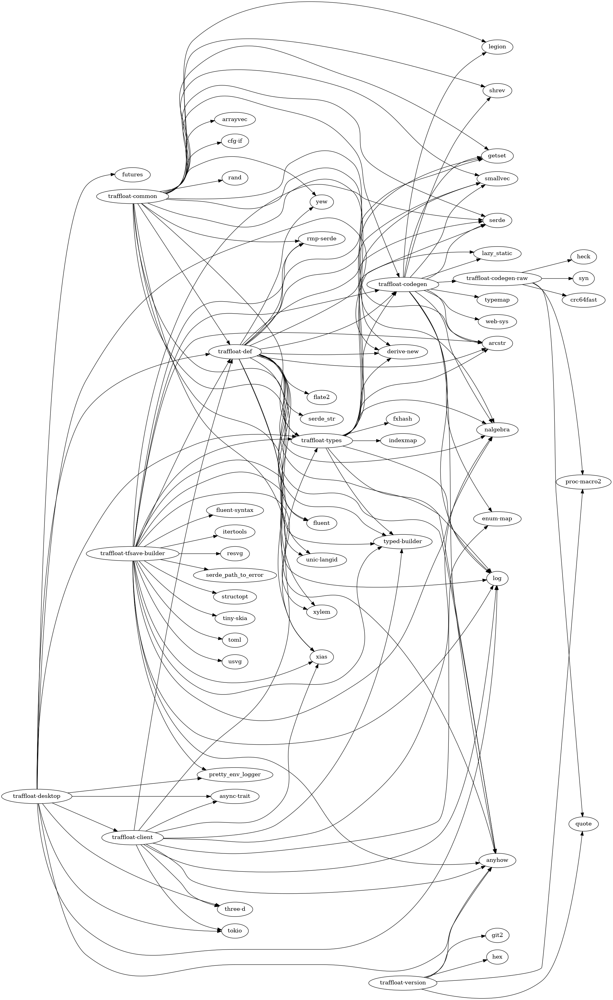

# API documentation
- [client](./client)
- [codegen](./codegen)
- [traffloat_codegen_raw](./traffloat_codegen_raw)
- [traffloat](./traffloat)
- [safety](./safety)
- [traffloat_types](./traffloat_types)
- [traffloat_version](./traffloat_version)

## Code statistics
```
===============================================================================
 Language            Files        Lines         Code     Comments       Blanks
===============================================================================
 GLSL                   10          148          103           16           29
 JavaScript              5           96           84            0           12
 JSON                    1            5            5            0            0
 Python                  1          248          199            2           47
 Ruby                    1          606          419           61          126
 Plain Text              1            2            0            2            0
 TOML                    8          259          232            2           25
-------------------------------------------------------------------------------
 HTML                    2           63           60            0            3
 |- CSS                  2           10           10            0            0
 (Total)                             73           70            0            3
-------------------------------------------------------------------------------
 Markdown                1          105            0           80           25
 |- Shell                1            8            5            3            0
 (Total)                            113            5           83           25
-------------------------------------------------------------------------------
 Rust                   91         9965         8631           96         1238
 |- Markdown            86         1292            0         1199           93
 (Total)                          11257         8631         1295         1331
===============================================================================
 Total                 121        11497         9733          259         1505
===============================================================================
```

## Dependency graph

